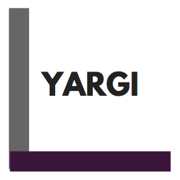

  

# Yargi Programming Language
A statically typed object-oriented programming language written in Python

## Features
* Variables  
* Functions
* Flow control statements (if, else, when)
* Loops (while, for..in)
* Classes
* Data Classes

### Primitives & Variables
Variables can be declared in single variable form `int x;` or multiple variable form `int x, y;`
```  
int x;
float y;
bool z;
string s;

x = 5;
y = 10;
z = true;
w = "Hi!";
```

### Operators
Arithmetic: `+`, `-`, `*`, `/`  
Logic: `and`, `or`  
Relational: `>`, `<`, `>=`, `<=`, `==`, `!=`  

### Functions
Function declaration follows the syntax:
```  
fun FUN_NAME( [<ARGS>,] ) [: RETURN_TYPE] {
  < DECLARATIONS >
  < STATEMENTS >
}
```  
#### Examples
A function with no return value:
```
fun sayHi() {
  write("Hi");
}
```  
A function with return value:  
```  
fun sum(int a, int b): int {
  return a + b;
}  
```

### Flow Control
#### If / Else Statements
The syntax for `if|else` flow control statements is as follows:  
```  
if (< expression >) {
  < statements >
} else {
  < statements >
}  
```
##### Example  
```  
if (10 > 5 + 4) {
  write("Hi!");
} else {
  write("Bye!");
}
```  
Yargi does not support traditional `else if` branches, instead we have the `when` flow control statement.

#### When Statements
The syntax for `when` flow control statements is as follows:
```  
when {
  < expresion > -> { < statements > }
  < expresion > -> { < statements > }
  [ else -> { <statements> } ]
}
```
##### Examples
```  
when {
  5 > a -> { write("Hi"); }
  true -> {
     write("Hola");
     ....
  }
  1 + 1 == 2 -> { write("1 plus 1 is two); }
  else -> {
    write("Non of the above");
  }
}
```
The `else` branch is optional:  
```  
when {
  true -> { write("Hi"); }
  false -> { write("Hola"); }
}
```

### Loops
#### ForIn Loops
The syntax for `for in` loops is as follows:  
```  
for (< var > in < start >..< end >) {
  < statements >
}
```  
##### Examples
```  
for (i in 0..10) {
  write(i);
}
```

```  
for (i in a..b) {
  write(i);
}
```  

#### While Loops
The syntax for `while` loops is as follows:
```  
while ( <expression> ) {
  < statements >
}
```
##### Example  
```  
while (x < 10 ) {
  write(x);
  x = x + 1;
}
```  

### Classes
Classes are defined with the following syntax:  
```
class CLASS_NAME( [CONSTRUCTOR_ARGS,] ) {
  [ global vars ]
  
  [ functions ]
  
  [ main() { < statements >}
}
```
#### Examples
```
class Calculator(int total) {

    fun total(): int {
        return total;
    }

    fun add(int n) {
        total = total + n;
    }

    fun sum(int a, int b): int {
        return a + b;
    }

    fun sub(int a, int b): int {
        return a - b;
    }
}
```
```
class Main {

    Calculator calculator;

    main() {
        calculator = Calculator(50);

        write(calculator.total()); // prints 50.
        calculator.add(30);
        write(calculator.total()); // prints 80.
        
        write(calculator.sum(2, 2)); // prints 4.
        write(calculator.sub(2, 2)); // prints 0.
    }
}
```
### Data Classes
Yargi supports a special tyoe of class whose main purpose is to hold data. Its fields are public and immutable.  
Its syntax is as follows:  
```  
data class([<ARGS>,])
```
#### Examples
```  
data class Person(int id, string name, string lastname)
```
```  
data class Dog(
  int id,
  string name,
  string breed,
  int age,
  string color,
  int owner
)
```
